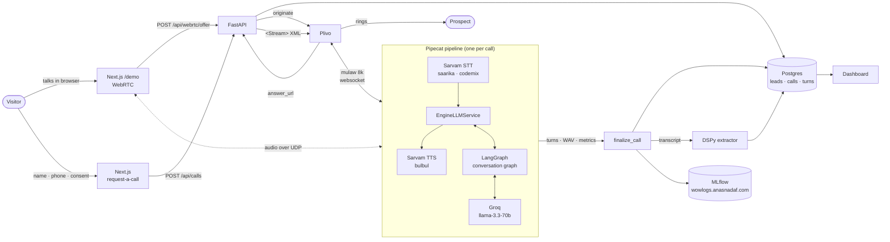

# Architecture

## The call, end to end



Every vendor box is selected by env config and sits behind an adapter:
`STT_PROVIDER` (Sarvam ⇄ Gnani), `TTS_PROVIDER` (Sarvam ⇄ Rumik ⇄ Gnani),
`LLM_PROVIDER` (Groq ⇄ Cerebras — both OpenAI-compatible), `TELEPHONY_PROVIDER`
(Plivo, with Pipecat serializers for Exotel and Twilio available behind the same
seam).

Rumik reads its own `RUMIK_*` voice settings rather than the shared `TTS_MODEL`
/ `TTS_VOICE` pair, so `TTS_PROVIDER` stays a one-line swap in both directions.
On `mulberry` an empty `RUMIK_VOICE` lets the model generate a voice from
`RUMIK_DESCRIPTION`.

`RUMIK_MODEL=muga` reaches further than the transport, because muga wants a tone
tag (`[neutral]`, `[happy]`, …) opening every utterance. `app/prompts/speech.py`
owns that vocabulary end to end: it adds the tag rules to the system prompt,
corrects an invented tag before the audio is synthesised, and strips tags out of
the transcript and the agent's own history. A tone tag is delivery, not speech,
so it exists only in the audio path — the dashboard, the stored turns and the
MLflow trace all show the sentence the caller actually heard. `speech_tags_required()`
is the single switch, so no other voice is ever asked for tags.

### How a call ends

Three guards stand between the graph deciding a call is over and the line
actually dropping, because every one of them was a real hang-up bug first.

1. **Noise cannot end a call.** Exit signals (`wrong_person`, `not_interested`,
   `busy`) are dropped from turns too short to carry them, so speech-to-text
   turning background noise into a word cannot hang up on a caller. `dnc` is
   exempt — it comes from an explicit-phrase regex the model cannot forge.
2. **The agent never hangs up on its own question.** The reply and the outcome
   are decided in the same superstep, so a closing turn can end on a question
   the caller never got to answer. Closing is held for one turn when that
   happens (`closing_deferred`).
3. **The goodbye is followed by silence, not a click.** `HANGUP_SILENCE_S`
   (seven seconds) of quiet is required before `EndTaskFrame` goes upstream. A
   caller who speaks first reopens the call for a final exchange under the
   wrap-up stage policy, bounded by `_MAX_RESUMES` and never granted after a
   do-not-call request.

## Why the pieces are where they are

**The conversation graph runs outside the LLM service, not inside a prompt.**
`EngineLLMService` (`server/app/voice/bridge.py`) occupies the slot a vendor
LLM service normally holds in the pipeline. It hands each user turn to the
LangGraph engine and streams the reply text back into TTS. So the pipeline
stays a plain audio loop while stage routing, slot state, and edge-case
handling live in testable Python — the graph is exercised in CI with scripted
fake models and no API keys.

**One streaming call per turn, plus one cheap parallel call.** Voice UX dies on
latency, so the reply is a single streaming completion on `llama-3.3-70b` whose
tokens flow to TTS as they arrive. A concurrent `llama-3.1-8b-instant` call
labels what the caller just said (checkpoints answered, language, irritation,
DNC) and steers the *next* turn. Nothing blocks the voice path waiting for
structured output.

**Checkpoints are never re-asked, structurally.** Slots are write-once, the
extractor labels every checkpoint on every turn regardless of stage, and the
prompt is handed exactly one next target plus an explicit list of what is
already answered. Volunteering intent and budget in the greeting skips both
questions.

**A browser call and a phone call are the same call.** Only the transport
differs: both build the same pipeline, write the same `Call` row (a web call
simply has no phone lead), record the same WAV, and run the same post-call
analysis. That keeps the demo honest — what a reviewer hears in the browser is
the production agent, not a simplified stand-in — and it means the phone path
can be enabled by configuration rather than reimplementation.

**Analysis is post-call.** Qualification extraction (DSPy `ChainOfThought`)
runs after hangup where latency is free, and its failure can't affect a live
call — `finalize_call` treats both extraction and MLflow logging as best-effort.

## Repository layout

```
server/app/
  agent/        LangGraph state, graph, ConversationEngine
  prompts/      persona, pronunciation dictionary, stage policies, project KB
  voice/        Pipecat pipeline, provider adapters, Plivo + WebRTC transports,
                engine bridge, transcript/metrics observers, recorder
  analysis/     DSPy qualification extractor
  obs/          MLflow setup and per-call runs
  api/, db/     REST surface and SQLAlchemy models
  call_flow.py  call lifecycle: status transitions, persistence, post-call chain
web/src/app/    landing page + dashboard (calls, leads, call detail)
deploy/         production compose, nginx, EC2 provisioning, runbook
```

## Observability

One MLflow run per call, tagged with the call id: vendor/model params, duration
and turn counts, per-service TTFB and processing latency aggregated from
Pipecat's metrics frames, plus transcript, agent state, qualification and the
call recording as artifacts. `mlflow.langchain.autolog()` and
`mlflow.dspy.autolog()` add per-turn traces, so a slow or wrong reply can be
opened and read turn by turn.
