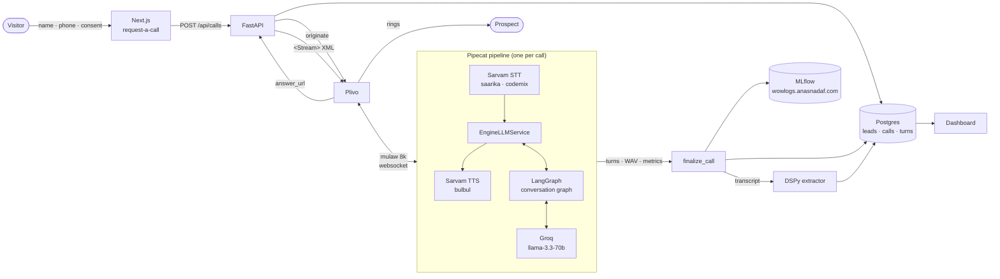

# Architecture

## The call, end to end



Every vendor box is selected by env config and sits behind an adapter:
`STT_PROVIDER` / `TTS_PROVIDER` (Sarvam ⇄ Gnani), `LLM_PROVIDER` (Groq ⇄
Cerebras — both OpenAI-compatible), `TELEPHONY_PROVIDER` (Plivo, with Pipecat
serializers for Exotel and Twilio available behind the same seam).

## Why the pieces are where they are

**The conversation graph runs outside the LLM service, not inside a prompt.**
`EngineLLMService` (`server/app/voice/bridge.py`) occupies the slot a vendor
LLM service normally holds in the pipeline. It hands each user turn to the
LangGraph engine and streams the reply text back into TTS. So the pipeline
stays a plain audio loop while stage routing, slot state, and edge-case
handling live in testable Python — the graph is exercised in CI with scripted
fake models and no API keys.

**One streaming call per turn, plus one cheap parallel call.** Voice UX dies on
latency, so the reply is a single streaming completion on `llama-3.3-70b` whose
tokens flow to TTS as they arrive. A concurrent `llama-3.1-8b-instant` call
labels what the caller just said (checkpoints answered, language, irritation,
DNC) and steers the *next* turn. Nothing blocks the voice path waiting for
structured output.

**Checkpoints are never re-asked, structurally.** Slots are write-once, the
extractor labels every checkpoint on every turn regardless of stage, and the
prompt is handed exactly one next target plus an explicit list of what is
already answered. Volunteering intent and budget in the greeting skips both
questions.

**Analysis is post-call.** Qualification extraction (DSPy `ChainOfThought`)
runs after hangup where latency is free, and its failure can't affect a live
call — `finalize_call` treats both extraction and MLflow logging as best-effort.

## Repository layout

```
server/app/
  agent/        LangGraph state, graph, ConversationEngine
  prompts/      persona, pronunciation dictionary, stage policies, project KB
  voice/        Pipecat pipeline, provider adapters, Plivo + WebRTC transports,
                engine bridge, transcript/metrics observers, recorder
  analysis/     DSPy qualification extractor
  obs/          MLflow setup and per-call runs
  api/, db/     REST surface and SQLAlchemy models
  call_flow.py  call lifecycle: status transitions, persistence, post-call chain
web/src/app/    landing page + dashboard (calls, leads, call detail)
deploy/         production compose, nginx, EC2 provisioning, runbook
```

## Observability

One MLflow run per call, tagged with the call id: vendor/model params, duration
and turn counts, per-service TTFB and processing latency aggregated from
Pipecat's metrics frames, plus transcript, agent state, qualification and the
call recording as artifacts. `mlflow.langchain.autolog()` and
`mlflow.dspy.autolog()` add per-turn traces, so a slow or wrong reply can be
opened and read turn by turn.
